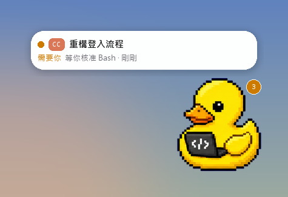
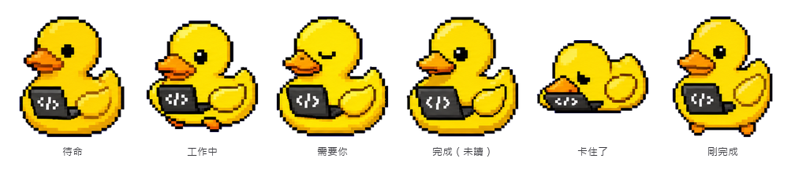

# claude-code-with-codex-pet

**繁體中文** · [English](README.en.md)

讓 Claude Code（CC）和 Codex 共用同一隻桌寵的 Claude Code mod。

它用的是 Codex 自己的寵物（`~/.codex/pets`），會在桌面上放一隻永遠在最上層的桌寵，同時追蹤 CC 和 Codex 每個對話在做什麼，外觀和行為仿照 Codex App 原版的桌寵。

> 這是個人專案，跟 OpenAI 或 Anthropic 沒有關係。Claude Code 的 mod 介面（function hooks）目前還是 early access，之後的版本可能會變動。

## 截圖

<table>
  <tr>
    <td align="center"><br>平常：寵物、角標，加上最緊急的一張卡片</td>
    <td align="center"><br>滑鼠移上去：展開所有 CC 和 Codex 對話</td>
  </tr>
</table>

<p align="center"></p>

截圖由桌寵自己的繪圖程式產生，卡片是範例資料。寵物是 [codex-pet-share](https://github.com/portons/codex-pet-share) 專案裡的 Debug Duck（MIT 授權）。

## 跟 Codex 寵物社群通用

這個 mod 不用自己的寵物格式，直接讀 Codex 的寵物資料夾 `${CODEX_HOME:-~/.codex}/pets/<id>/`（`pet.json` + `spritesheet.webp`），所以：

- **Codex 能用的寵物，這裡都能用**：你在 Codex 裡選的、用 hatch-pet 孵的、自己做的，都會自動出現。
- **v1 和 v2 都支援**：v1 是 1536×1872（9 列），v2 是 1536×2288（9 列 + 16 方向的兩列）。
- **[codex-pets.net](https://codex-pets.net/) 上的社群寵物可以直接用**。網站上每隻寵物都有安裝指令，裝完就會出現在 `/pet list`：

  ```bash
  npx codex-pets add <寵物 id>
  ```

  寵物 id 就是網址裡的那段，例如 `https://codex-pets.net/#/pets/nino` 的 `nino`。這個指令會把寵物裝到 `~/.codex/pets/<id>/`，跟 Codex 和這個 mod 讀的是同一個資料夾，所以裝一次，Codex 和 CC 都看得到。裝好後用 `/pet <id>` 切換，或在 Codex 裡選它。

## 功能

- **同一隻寵物**：直接讀 Codex 的寵物資料夾，用 hatch-pet 孵出來的寵物 CC 也看得到。預設跟著 Codex 選的寵物；Codex 選的是雲端寵物時，會用 Codex 的遷移紀錄找回本機那份圖。
- **活動列表**：每個 CC 對話和 Codex 對話各一張卡片，顯示標題、狀態（需要你 / 卡住了 / 完成 / 工作中）、正在做什麼、多久以前。順序跟原版一樣：需要你 → 卡住了 → 完成 → 工作中。
- **點卡片跳過去**：CC 用 `claude://code/continue?session=…`，Codex 用 `codex://threads/…`。打開過的「完成」卡片會自動清掉。
- **寵物動作**跟著最緊急的那張卡片走；剛完成會跳一下，拖曳時會往左右跑。
- **角標**顯示有幾件事需要你處理；滑鼠移到寵物上會展開列表。
- **任意大小**：30%～300%（100% 是「中」）。右鍵選單有小（75%）、中、大（130%）三種預設，選「自訂…」會開一個滑桿視窗，拉的時候寵物會跟著變大變小。也可以用 `/pet-size` 指令設定。
- **兩種擺放模式**（右鍵選單的「擺放模式」或 `/pet-mode`）：
  - **懸停**（預設）：拖到哪就停在哪。
  - **物理**：放開後會掉下來，落地彈 2～3 下，最後停在工作列上方。拖著甩出去再放開，寵物會飛出去，撞到螢幕邊緣會反彈；半空中可以抓住它。多螢幕時會落在寵物所在那個螢幕的工作列上；旁邊有其他螢幕的那一側不算牆，可以丟過去。
- **右鍵選單**：大小、擺放模式、固定展開、清掉已完成的卡片、揮手、重新載入、隱藏、關閉。
- **`Win+Alt+O`** 顯示或隱藏桌寵（跟 Codex 的 `Win+Alt+P` 錯開）。
- Windows 關掉「動畫效果」時只顯示靜止畫面；物理模式下會直接落地，不會飛行或彈跳。
- 大小、擺放模式和位置都會記住，下次打開還是一樣。

## 需求

- Windows 10 / 11
- Claude Code（桌面版 Code 分頁或 CLI），版本要支援 function hooks 的 mod
- Python 3 和 [Pillow](https://pypi.org/project/pillow/)（`py -3 -m pip install pillow`），桌寵視窗用 tkinter 畫
- Codex App，以及至少一隻放在 `~/.codex/pets/<名字>/` 的寵物（`pet.json` + `spritesheet.webp`）

## 安裝

在 PowerShell 裡執行：

```powershell
git clone https://github.com/John-owo/claude-code-with-codex-pet.git "$env:USERPROFILE\.claude\mods\codex-pet"
cd "$env:USERPROFILE\.claude\mods\codex-pet"
powershell -ExecutionPolicy Bypass -File .\install.ps1
```

`install.ps1` 會：

1. 檢查 Python 啟動器（`py`）、tkinter 和 Pillow；缺 Pillow 時問你要不要用 pip 裝。
2. 把這個資料夾加進 `~/.claude/settings.json` 的 `env.CLAUDE_CODE_PLUGIN_DIRS`，讓每個 CC 對話都載入它。其他設定都會保留，修改前會先備份成 `settings.json.bak-codex-pet`。
3. 檢查 `~/.codex/pets` 裡有沒有寵物。

裝好後開一個新的 CC 對話，桌寵就會出現。要移除的話，執行 `powershell -ExecutionPolicy Bypass -File .\install.ps1 -Uninstall`。

<details>
<summary>手動安裝</summary>

把 repo clone 到固定的位置，再在 `~/.claude/settings.json` 的 `env` 加上這個資料夾（已經有其他資料夾的話，用 `;` 隔開）：

```json
{
  "env": {
    "CLAUDE_CODE_PLUGIN_DIRS": "C:\\Users\\<你的帳號>\\.claude\\mods\\codex-pet"
  }
}
```

</details>

## 指令

在 CC 輸入框裡：

| 指令 | 作用 |
|---|---|
| `/pet` 或 `/pet list` | 列出 `~/.codex/pets` 裡的寵物 |
| `/pet <id>` | 換成這隻寵物 |
| `/pet codex` | 回到跟著 Codex 的選擇 |
| `/pet-on` | 打開桌寵（也可用 `/pet overlay on`） |
| `/pet-off` | 關掉桌寵（也可用 `/pet overlay off`）（下次開新對話會再自動打開） |
| `/pet-size <大小>` | 設定桌寵大小：30～300 的百分比（例如 `/pet-size 150`），或 `小` / `中` / `大`。不加參數會顯示目前大小。也可用 `/pet size …` |
| `/pet-mode <模式>` | 切換擺放模式：`懸停`、`物理`，或 `切換`（在兩者之間切換）。不加參數會顯示目前模式。也可用 `/pet mode …` |
| `/pet show` / `/pet hide` | 顯示 / 隱藏 CC 輸入框上方的小寵物（有桌寵時預設隱藏） |
| `/pet reload` | 重新讀取寵物圖 |

在 Claude 桌面版的指令列表裡，`/pet-on`、`/pet-off`、`/pet-size`、`/pet-mode` 會顯示成 `/codex-pet:pet-on` 這類寫法。兩種寫法效果一樣，都由 mod 直接處理，不會多跑一次模型。

`/pet-size` 和 `/pet-mode` 會把設定寫進 `~/.codex-pet/request.json`，桌寵在半秒內套用並記住。桌寵沒開的話，下次打開時套用。

## 設定

mod 的選項（`userConfig`）：

| 選項 | 預設 | 說明 |
|---|---|---|
| `python` | 空白 | 有裝 Pillow 的 Python 路徑；空白時依序試 `py -3`、`python3`、`python` |
| `pet` | 空白 | 指定寵物資料夾名稱；空白時跟著 Codex 的選擇 |
| `overlay` | `true` | 開對話時要不要自動打開桌寵 |

## 怎麼運作的

```
CC 對話 ──(mod 寫入)──> ~/.codex-pet/sessions/cc-<id>.json ─┐
                                                              ├─> 桌寵視窗 (overlay/pet_overlay.py)
Codex ──(Codex 自己寫的對話紀錄)── ~/.codex/sessions/... ────┘
```

- `hooks/register.tsx`：CC 的 mod。依照 CC 的事件（開始回合、呼叫工具、等你核准、回合結束）更新這個對話的狀態檔，每 30 秒送一次心跳；也負責啟動桌寵。
- `overlay/pet_overlay.py`：桌寵視窗本身（Win32 layered window，整個畫面用 Pillow 畫）。只會同時跑一隻；新版本會自動接手舊版本。
- `overlay/physics.py`：物理模式的計算（重力、反彈、摩擦、甩出去的初速）和大小的換算，都是不依賴視窗的純函式。
- `overlay/sources.py`：讀 CC 的狀態檔、Claude 桌面版的對話紀錄（拿標題和跳轉用的 id），以及 Codex 的 `session_index.jsonl` 和對話紀錄。
- `bake/bake_pet.py`：找出要用的寵物，並把 spritesheet 切成影格。

所有資料都只在你自己的電腦上讀寫，不會傳到任何地方。桌寵的位置、大小、擺放模式等偏好存在 `~/.codex-pet/overlay.json`，錯誤紀錄在 `~/.codex-pet/overlay-error.log`。

## 已知限制

- Codex 的對話紀錄裡沒有「等你核准」的事件，所以 Codex 卡片不會顯示「需要你」。
- Codex 那邊讀過的「完成」狀態只存在 Codex App 裡，桌寵看不到；點卡片或按 × 可以清掉，3 小時後也會自動清掉。
- 看向游標要 v2 寵物（有 16 方向那兩列圖）才有，目前還沒做。
- 只在 Codex 端上傳過、本機沒有副本的雲端寵物讀不到圖。

## 開發

```bash
claude plugin validate .
claude plugin test .
py -3 -m unittest discover -s tests
```

最後一行跑桌寵物理和大小計算的測試（`tests/test_physics.py`）。

## 授權

[MIT](LICENSE)
